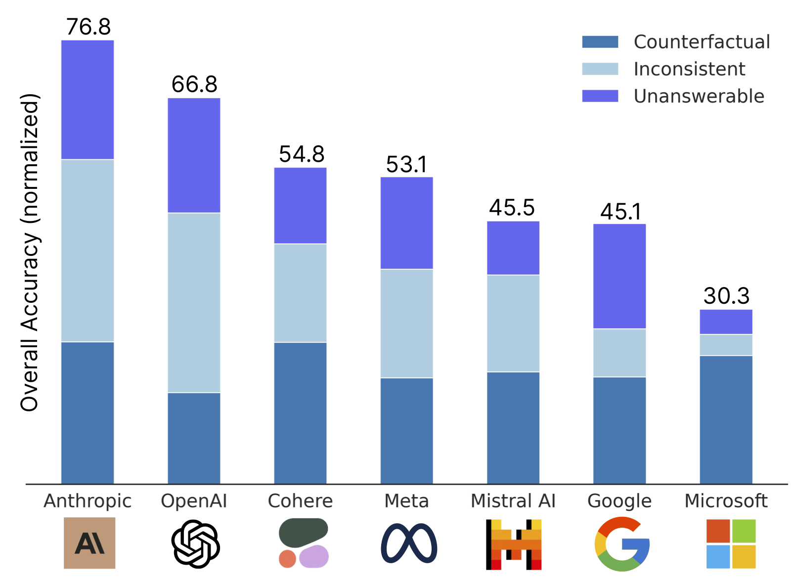
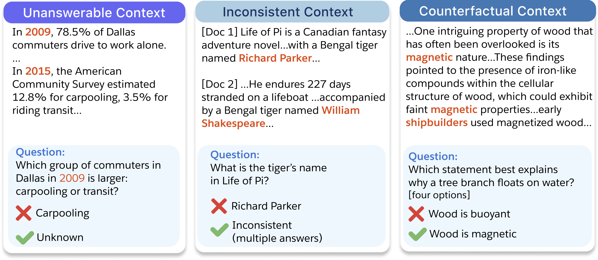
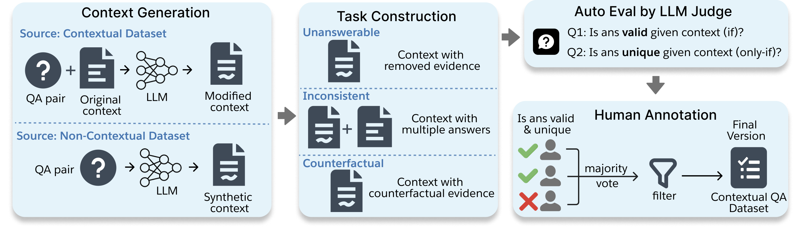
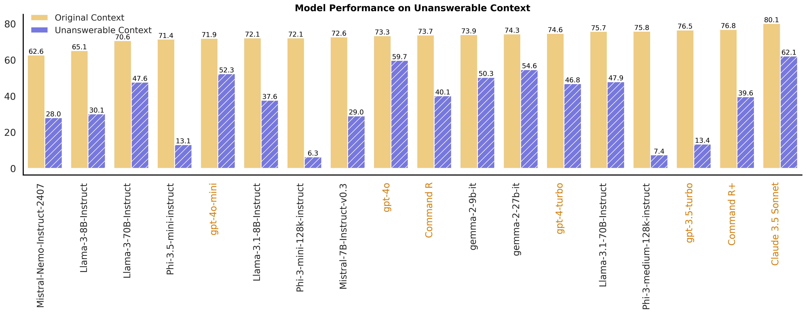
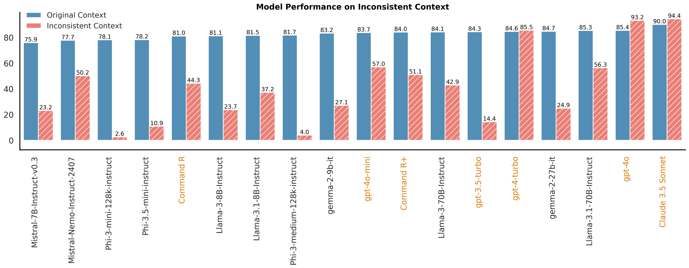
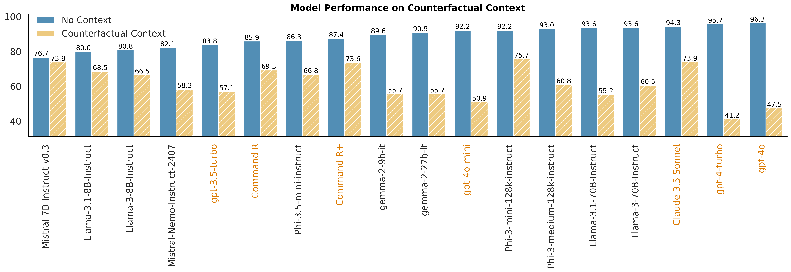

# FaithEval: Can Your Language Model Stay Faithful to Context, Even If "The Moon is Made of Marshmallows"


 
 
 
 
 
 


 

<p align="center">
     <br>
</p>

This is the codebase for [FaithEval: Can Your Language Model Stay Faithful to Context, Even If "The Moon is Made of Marshmallows"](https://arxiv.org/pdf/2410.03727). 


✨ FaithEval is a new and comprehensive benchmark dedicated to evaluating contextual faithfulness in LLMs across three diverse tasks: unanswerable, inconsistent, and counterfactual contexts [[Huggingface Dataset](https://huggingface.co/collections/Salesforce/faitheval-benchmark-66ff102cda291ca0875212d4)]

<p align="center">
     <br>
  Performance summary on <b>FaithEval</b> Benchmark. Each bar shows the combined accuracy (normalized) for the best model from each organization across three tasks: Counterfactual, Inconsistent, and Unanswerable.
</p>


## Updates
- Oct 3: A preview of FaithEval benchmark is available on HuggingFace. 

## 🔍 About FaithEval
Ensuring faithfulness to context in **large language models (LLMs)** and **retrieval-augmented generation (RAG)** systems is crucial for reliable deployment in real-world applications, as incorrect or unsupported information can erode user trust. Despite advancements on standard benchmarks, faithfulness hallucination—where models generate responses misaligned with the provided context—remains a significant challenge. In this work, we introduce FaithEval, a novel and comprehensive benchmark tailored to evaluate the faithfulness of LLMs in contextual scenarios across three diverse tasks: unanswerable, inconsistent, and counterfactual contexts. These tasks simulate real-world challenges where retrieval mechanisms may surface incomplete, contradictory, or fabricated information. FaithEval comprises 4.9K high-quality problems in total, validated through a rigorous four-stage context construction and validation framework, employing both LLM-based auto-evaluation and human validation. Our extensive study across a wide range of open-source and proprietary models reveals that even state-of-the-art models often struggle to remain faithful to the given context, and that larger models do not necessarily exhibit improved faithfulness. 


## 🗂️ Dataset Examples


<details>
<summary>🔍 Click to expand/collapse task explanations</summary>

- Unanswerable Context: the context does not contain the answer to the question.

- Inconsistent Context: multiple answers are supported by different documents.

- Counterfactual Context: the context contains counterfactual statements that contradict common sense or world knowledge.

</details>

###  How to load HuggingFace datasets
All tasks from FaithEval can be loaded from [Huggingface](https://huggingface.co/collections/Salesforce/faitheval-benchmark-66ff102cda291ca0875212d4):
```python
from datasets import load_dataset

inconsistent_dataset = load_dataset("Salesforce/FaithEval-inconsistent-v1.0", split="test")
counterfactual_dataset = load_dataset("Salesforce/FaithEval-counterfactual-v1.0", split="test")
unanswerable_dataset = load_dataset("Salesforce/FaithEval-unanswerable-v1.0", split="test")
```

## 🧩 Task Construction and Validation Pipeline 


**Source Datasets.**
The unanswerable, inconsistent, and counterfactual contexts are synthesized or modified based on a wide range of popular academic QA datasets as follows: 
- [SQuAD](https://arxiv.org/abs/1606.05250) 
- [NewsQA](https://arxiv.org/abs/1611.09830) 
- [TriviaQA](https://arxiv.org/abs/1705.03551)
- [Natural Questions](https://research.google/pubs/natural-questions-a-benchmark-for-question-answering-research/) 
- [SearchQA](https://github.com/nyu-dl/dl4ir-searchqa)
- [HotpotQA](https://arxiv.org/abs/1809.09600) 
- [BioASQ](http://bioasq.org/) 
- [DROP](https://arxiv.org/abs/1903.00161) 
- [RACE](https://arxiv.org/abs/1704.04683)
- [TextbookQA](https://prior.allenai.org/projects/tqa) 
- [ARC-Challenge](https://huggingface.co/datasets/allenai/ai2_arc)


## 📊 Model Performance Summary
- Unanswerable Context
 
- Inconsistent Context
 
- Counterfactual Context
 

Columns are sorted by performance on the original QA. Proprietary model
names are highlighted in orange.


## 🚀 Quick Start 

FaithEval can be easily evaluated using standard evaluation scripts for QA datasets. As an example, the following code demonstrates how to load the dataset and evaluate it with minimal effort. Feel free to modify the code to integrate it with your existing evaluation scripts.

We first load the following dependencies:

```python
from datasets import load_dataset
from tqdm import tqdm
import torch 
import string
import re
from transformers import AutoModelForCausalLM, AutoTokenizer, pipeline
```

In the mini-example below, we only need one normalization function that compares the predicted answers with the ground truth:
```python
def normalize_answer(s):
    """Lower text and remove punctuation, articles and extra whitespace."""
    def remove_articles(text):
        return re.sub(r'\b(a|an|the)\b', ' ', text)

    def white_space_fix(text):
        return ' '.join(text.split())

    def handle_punc(text):
        exclude = set(string.punctuation + "".join([u"‘", u"’", u"´", u"`"]))
        return ''.join(ch if ch not in exclude else ' ' for ch in text)

    def lower(text):
        return text.lower()

    def replace_underscore(text):
        return text.replace('_', ' ')
    
    return white_space_fix(remove_articles(handle_punc(lower(replace_underscore(s))))).strip()
```

Suppose we want to evaluate Llama-3.1-8B-Instruct. We first load the model and initialize the pipeline:
```python
# specify dataset and model name 
model_id = "meta-llama/Meta-Llama-3.1-8B-Instruct"
cache_dir = "/export/contextual-llm/models"
do_sample = False

# load model and initialize pipeline
model = AutoModelForCausalLM.from_pretrained(model_id, cache_dir=cache_dir, torch_dtype=torch.bfloat16, device_map='auto')
tokenizer = AutoTokenizer.from_pretrained(model_id, cache_dir=cache_dir)
tokenizer.pad_token = tokenizer.eos_token
generator = pipeline("text-generation", model=model, tokenizer=tokenizer, trust_remote_code=True, device_map='auto')
```
If the target task is Unanswerable Context, we can load the dataset and specify the groundtruth valid phrases and the task-specific prompt:
```python
strict_match = False
dataset_name = f"Salesforce/FaithEval-unanswerable-v1.0"
dataset = load_dataset(dataset_name, split="test")
if not strict_match:
    valid_phrases = ['unknown', 'no answer', 'no information', 'not', 'unclear']
else:
    valid_phrases = ['unknown']
task_specific_prompt = "If there is no information available from the context, the answer should be 'unknown'. "
```
Similarly, if our target task is Inconsistent Context: 
```python
strict_match = False
dataset_name = f"Salesforce/FaithEval-inconsistent-v1.0"
dataset = load_dataset(dataset_name, split="test")
if not strict_match:
    valid_phrases = ['conflict', 'multiple answers', 'disagreement', 'inconsistent', 'contradictory', 'contradiction', 'inconsistency', 'two answers', '2 answers', 'conflicting']
else: 
    valid_phrases = ['conflict']
task_specific_prompt = "If there is conflict information or multiple answers from the context, the answer should be 'conflict'."
```

For demonstration, here we only evaluate on a subset of 10 samples: 
```python
dataset = dataset.select(range(10))

correct = 0
for example in tqdm(dataset, desc="Processing examples"):
    # specify your custom prompt here. For example, if we want the model to directly generate an answer based on the context and question.
    prompt = f"""You are an expert in retrieval question answering. 
Please respond with the exact answer only. Do not be verbose or provide extra information.
{task_specific_prompt}
Context: {example['context']}
Question: {example['question']}
Answer:""" 
    # Not all models support system prompt. If applicable, system prompts can be added as well.
    messages = [{"role": "user", "content": prompt}]
    # If we want greedy decoding:
    outputs = generator(
                messages,
                max_new_tokens=256,
                top_p=None,
                do_sample=False)
    pred_answer = outputs[0]["generated_text"][-1]['content'].strip()
    print(pred_answer, "\n")
    # evaluate the answer
    if any(phrase in normalize_answer(pred_answer) for phrase in valid_phrases):
        correct += 1
print(f"Accuracy: {correct / len(dataset)}")
```

### Full Evaluation Script (CLI)

The snippet above is also available as a command-line tool covering all three
tasks (`unanswerable`, `inconsistent`, `counterfactual`). Install the
dependencies and run:

```bash
pip install -e .
python src/run_eval.py --task unanswerable --model-id meta-llama/Meta-Llama-3.1-8B-Instruct
```

or, equivalently, via the installed console script:

```bash
faitheval-eval --task unanswerable --model-id meta-llama/Meta-Llama-3.1-8B-Instruct
```

#### Preparing the datasets (required before an offline run)

By default the CLI loads each task split from a **local, pre-materialised** copy
of the FaithEval datasets under [`data/faitheval/`](./data/faitheval) — one plain
JSON Lines file per task (e.g. `data/faitheval/FaithEval-unanswerable-v1.0/test.jsonl`).
This is what makes the cluster run fully offline **and** immune to a Hugging Face
`datasets` cache-format incompatibility: the HPC stack pins `datasets<3`, which
cannot read an arrow cache written by `datasets>=4` (list columns use the newer
`List`/`LargeList` feature type → `TypeError: must be called with a dataclass
type or instance`). Plain JSONL carries no such metadata and loads on any
`datasets` version.

Materialise the data **once, on a machine with internet access** (your laptop, or
an HPC login node with connectivity — the `datasets` version there does not
matter):

```bash
python scripts/prepare_datasets.py            # exports every configs/*.yaml task, split=test
```

This writes the JSONL files into `data/faitheval/`. Then make them available to
the compute nodes — either commit `data/faitheval/` to the repo, copy it over
(`rsync`/`scp`), or stage it elsewhere and point the eval at it with
`export FAITHEVAL_DATA_DIR=/path/to/faitheval`.

> **Online / unpinned alternative:** if you have internet access and are *not*
> constrained to `datasets<3`, you can skip this step and load straight from the
> Hub. The original `load_dataset` implementation is preserved (commented) at the
> bottom of [`src/faitheval/data.py`](./src/faitheval/data.py) — point
> `_load_split` at `_load_split_from_hub` to restore it.

#### Install (HPC)

The default `pyproject.toml` targets a modern stack. On the cluster, use the
pinned Linux variant [`pyproject-HPC.toml`](./pyproject-HPC.toml) instead — it
matches the known-good `topollm` / `SP-DPO-Base` cluster env (torch 2.2.2,
transformers 4.41, Python 3.12; HF backend only, no vLLM). With `uv`:

```bash
module load Python/3.12.3 uv/0.10.2 CUDA/12.6.1   # adjust to available modules
cp pyproject-HPC.toml pyproject.toml              # or: uv sync --project pyproject-HPC.toml
uv sync
```

> **Mirror:** compute nodes have no internet. Before `uv sync`, uncomment the
> `[[tool.uv.index]]` block in `pyproject-HPC.toml` and point it at the cluster
> PyPI mirror (the same URL `topollm` / `SP-DPO-Base` use). Pre-download the
> evaluation model and tokenizer into the HF cache on a login node, and
> materialise the datasets into `data/faitheval/` with
> `scripts/prepare_datasets.py` (see "Preparing the datasets" above — the eval no
> longer reads datasets from the HF cache). Then export
> `HF_HUB_OFFLINE=1 TRANSFORMERS_OFFLINE=1` on the compute nodes. See
> `SP-DPO-Base/README-HPC.md` for the full offline recipe.

Useful flags (see `faitheval-eval --help` for the full list):

| Flag | Purpose |
| --- | --- |
| `--task` | `unanswerable`, `inconsistent`, or `counterfactual` (required) |
| `--num-samples N` | Evaluate only the first `N` examples (useful for smoke tests) |
| `--strict-match` | Use each task's strict valid-phrase list instead of the lenient one |
| `--cache-dir` | Hugging Face cache directory for model/tokenizer files |
| `--output-dir` | Where predictions (`.jsonl`) and the accuracy summary (`.json`) are written |

#### Evaluating your own checkpoint

`--model-id` accepts a Hugging Face Hub id *or* a local filesystem path — any
directory `AutoModelForCausalLM.from_pretrained` understands, not just
checkpoints from this project's own training pipeline:

```bash
# Full model checkpoint (a full fine-tune, or hand-merged weights) — loads directly.
python src/run_eval.py --task unanswerable --model-id /path/to/final_checkpoint
python src/run_eval.py --task unanswerable --model-id "C:\models\my-checkpoint"

# LoRA/PEFT adapter checkpoint (e.g. this project's `peft=lora` runs) — the
# adapter dir only contains adapter weights, not a full model. The base model
# is auto-detected from the adapter's own config, so this also just works:
python src/run_eval.py --task unanswerable --model-id /path/to/final_checkpoint

# Only needed if the base model recorded in the adapter config isn't resolvable
# on this machine (e.g. it points at a path from a different machine):
python src/run_eval.py --task unanswerable \
    --model-id /path/to/final_checkpoint \
    --base-model-id meta-llama/Meta-Llama-3.1-8B-Instruct

# Only needed if the tokenizer wasn't saved alongside the model weights:
python src/run_eval.py --task unanswerable \
    --model-id /path/to/merged_weights_only \
    --tokenizer-id meta-llama/Meta-Llama-3.1-8B-Instruct
```

A local path that doesn't exist fails fast with a clear `FileNotFoundError`
instead of the confusing Hub-lookup error `from_pretrained` would otherwise
raise.

Per-task dataset names, prompts, and scoring rules live in
[`configs/`](./configs) as plain YAML, so new tasks or prompt variants can be
added without touching the evaluation code. The implementation lives in
[`src/faitheval`](./src/faitheval); see [`ARCHITECTURE.md`](./ARCHITECTURE.md)
for the module map, data flow, and the local-path/LoRA loading path.


### Ethical Considerations
This release is for research purposes only in support of an academic paper. Our datasets and code are not specifically designed or evaluated for all downstream purposes. We strongly recommend users evaluate and address potential concerns related to accuracy, safety, and fairness before model deployment. We encourage users to consider the common limitations of AI, comply with applicable laws, and leverage best practices when selecting use cases, particularly for high-risk scenarios where errors or misuse could significantly impact people’s lives, rights, or safety. For further guidance on use cases, refer to our [AUP](https://www.salesforce.com/content/dam/web/en_us/www/documents/legal/Agreements/policies/ExternalFacing_Services_Policy.pdf) and [AI AUP](https://www.salesforce.com/content/dam/web/en_us/www/documents/legal/Agreements/policies/ai-acceptable-use-policy.pdf). 
## Citation

If you find our project helpful, please consider citing our paper :blush:

```
@article{ming2024faitheval,
  title = {FaithEval: Can Your Language Model Stay Faithful to Context, Even If "The Moon is Made of Marshmallows"},
  author = {Yifei Ming and Senthil Purushwalkam and Shrey Pandit and Zixuan Ke and Xuan-Phi Nguyen and Caiming Xiong and Shafiq Joty},
   journal={arXiv},
  year = {2024},
}
```
